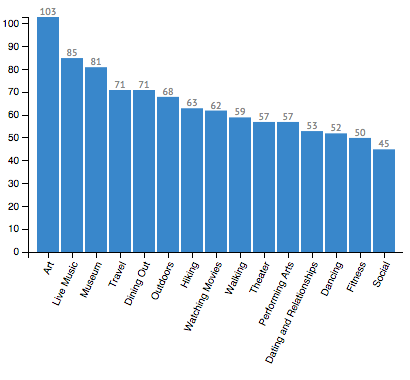

# Two small visualizations using Meetup's Api

** Looking through Meetup's api and the website's UI, I noticed that information about members was not easily seen by organizers. I decided to utalize the API to aggregate data regarding member's topical interests and location. This visualization centers around the "Boston Art" group, but this can be changed simply by altering the requests' group url.

&nbsp;

## 1) Topics Chart 

By seeing members' most shared topics, organizers can better tailor events to meet general interests. One of the top topics for the Boston Art Group was "Hiking", which one may not normally associate with artists. Knowing such could inspire organizers to plan a "hike and sketch" trip. 

## 2) Locations Map

This map draws red circles, whose size is determined by the number of members residing in the corresponding city. One can click on a red circle to reveal the city's name and membership count. The blue circles are drawn, representing events, on the coordinate of the venue. The blue circles' sizes are determined by the number of yes RSVPS. Clicking on a blue circle reveals the event's information and yes RSVP count. 

This visual, therefore, serves to generally show where membership resides and the convenience of events. Similarly, organizers see if the potential turn out mirrors the number of members nearby. 

